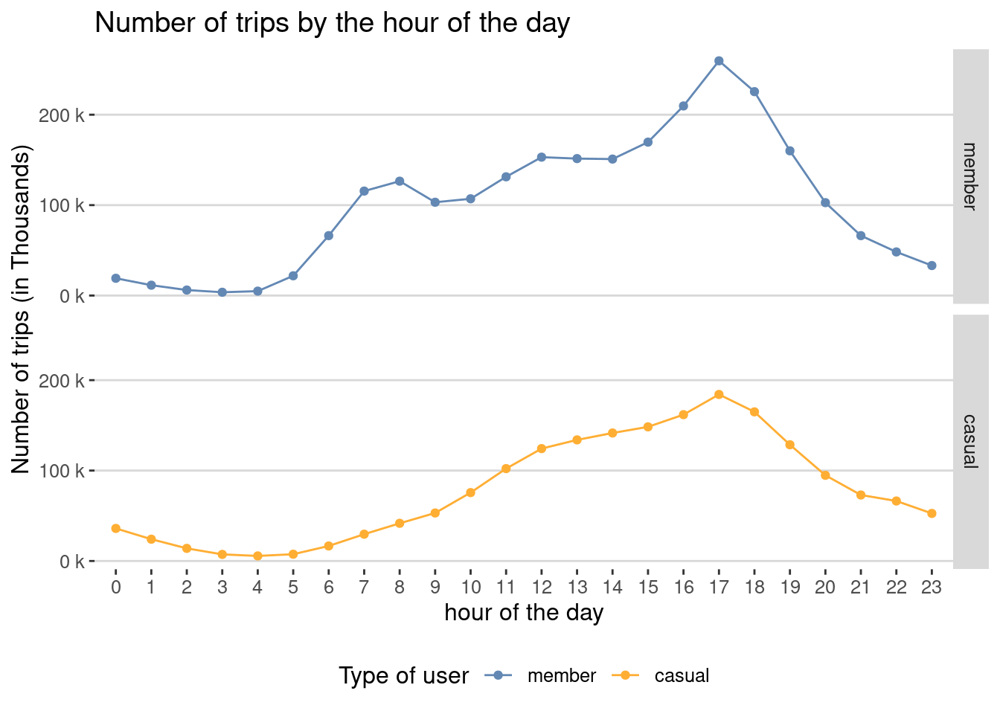
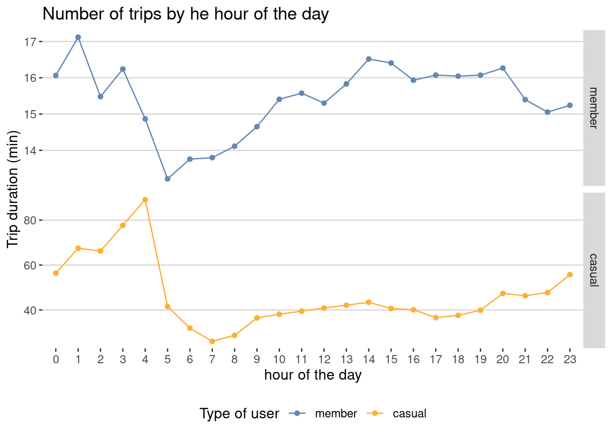
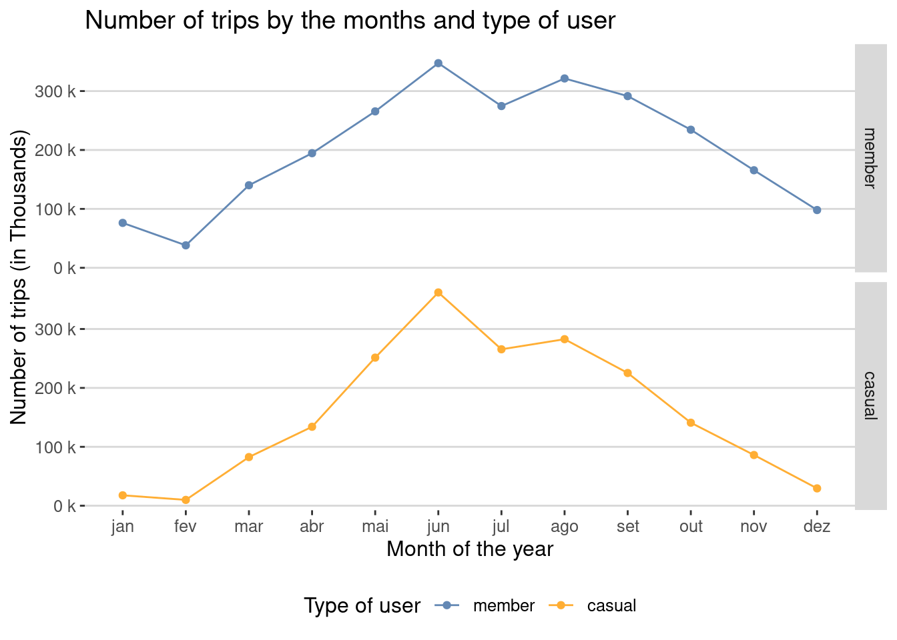
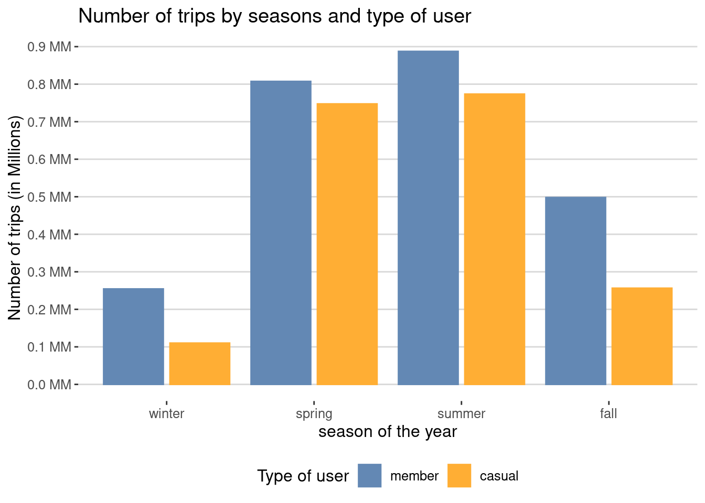
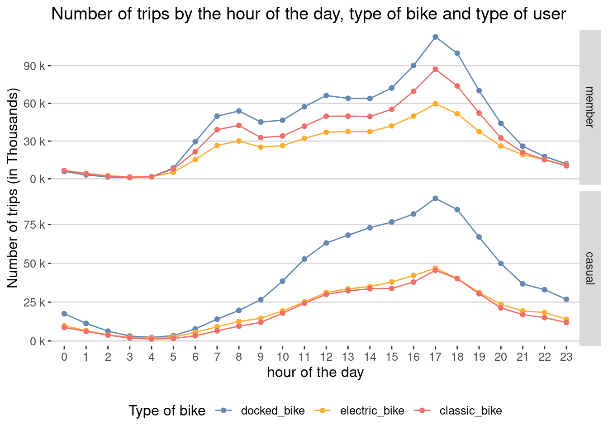
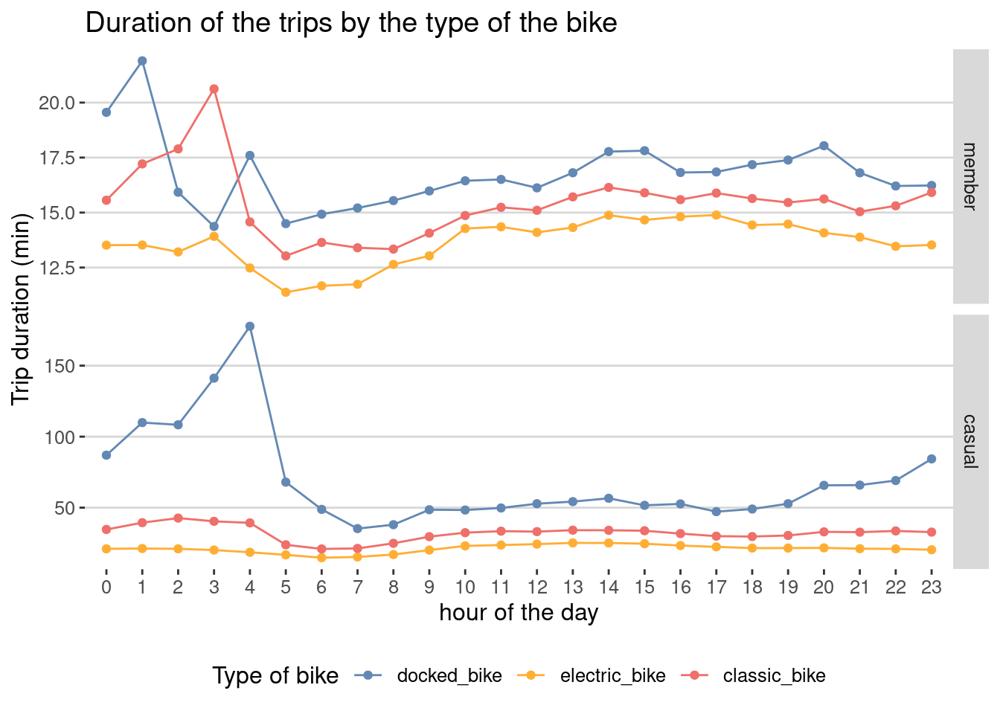
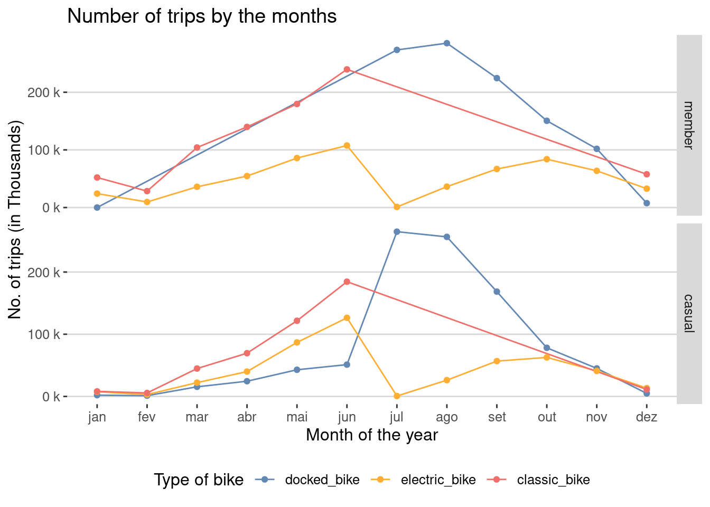
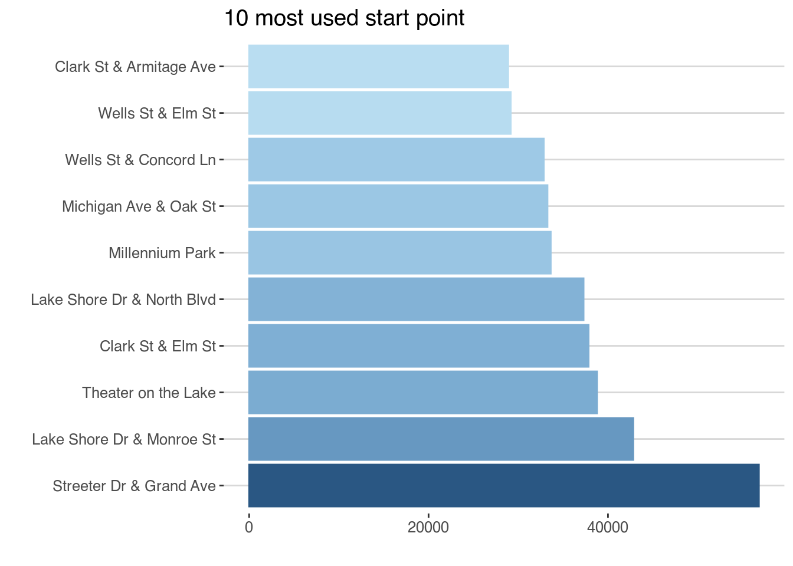
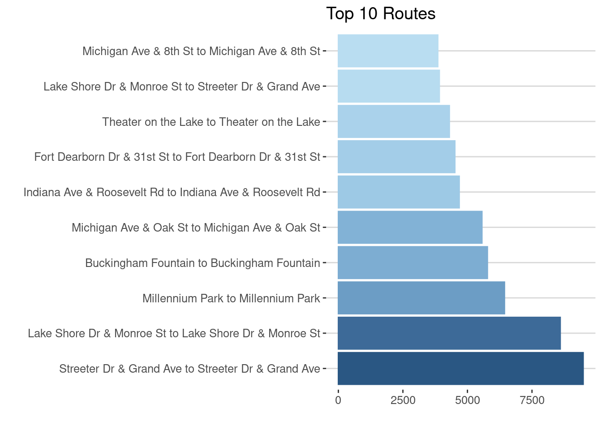

## Scenario

You are a junior data analyst working in the marketing analyst team at Cyclistic, a bike-share company in Chicago. The director of marketing believes the company's future success depends on maximizing the number of annual memberships. Therefore, your team wants to understand how casual riders and annual members use Cyclistic bikes differently. From these insights, your team will design a new marketing strategy to convert casual riders into annual members. But first, Cyclistic executives must approve your ecommendations, so they must be backed up with compelling data insights and professional data visualizations.

## Ask Phase

[**Guiding questions**]{.ul}

1.  What is the problem you are trying to solve?

    -   How do annual members and casual riders use Cyclistic bikes differently?

    -   Why would casual riders buy Cyclistic annual memberships?

    -   How can Cyclistic use digital media to influence casual riders to become members?

2.  How can your insights drive business decisions?

    -   improve the marketing campaign

3.  Identify the business task

    -   Undertand the diferente between casual users and members to improve the marketing campaign

4.  Consider key stakeholders

    -   Main stakeholders:

        -   Cyclistic executive team

        -   Lily Moreno

    -   Secundary stakeholder:

        -   Cyclistic marketing analytics team leader

## Prepare

1.  Where is your data located?

    -   [Cyclistic bikeshare database](https://divvy-tripdata.s3.amazonaws.com/index.html)

2.  How is the data organized?

    -   the data base is organized in 12 files with month data from july 2020 to june 2021.

3.  Are there issues with bias or credibility in this data?

    -   Reliable -Yes, the data is reliable. The data is a primary source data based on a fictional company.

    -   Original - Yes, the original public data can be located.

    -   Comprehensive - Yes, no vital information is missing.

    -   Current - Yes, the data base is updated monyhly.

4.  How are you addressing licensing, privacy, security, and accessibility?

    -   the data is distributed in this [license](https://www.divvybikes.com/data-license-agreement).

5.  How did you verify the data's integrity?

    -   Using R (ver. 4.1) and Rstudio (ver. 1.4)

6.  How does it help you answer your question?

    -   R is a powerful tool that makes it easy to manipulate large databases.

7.  Are there any problems with the data?

    -   Yes, Some missing values, but it did not interfere with the analysis.

## Process Phases

### Ingesting the data

-   Ingesting the data using the [vroom](https://vroom.r-lib.org/articles/vroom.html) library and loading into the bikeshare_data.


::: {.cell layout-align="center" hash='index_cache/html/unnamed-chunk-1_a1ed6176077d3e5ea7e5da0192da6ee2'}

```{.r .cell-code}
library(tidyverse) # used to filter the data
```

::: {.cell-output .cell-output-stderr}
```
── Attaching packages ─────────────────────────────────────── tidyverse 1.3.1 ──
```
:::

::: {.cell-output .cell-output-stderr}
```
✔ ggplot2 3.3.6     ✔ purrr   0.3.4
✔ tibble  3.1.7     ✔ dplyr   1.0.9
✔ tidyr   1.2.0     ✔ stringr 1.4.0
✔ readr   2.1.2     ✔ forcats 0.5.1
```
:::

::: {.cell-output .cell-output-stderr}
```
── Conflicts ────────────────────────────────────────── tidyverse_conflicts() ──
✖ dplyr::filter() masks stats::filter()
✖ dplyr::lag()    masks stats::lag()
```
:::

```{.r .cell-code}
library(lubridate) #used to work with date class. 
```

::: {.cell-output .cell-output-stderr}
```

Attaching package: 'lubridate'
```
:::

::: {.cell-output .cell-output-stderr}
```
The following objects are masked from 'package:base':

    date, intersect, setdiff, union
```
:::

```{.r .cell-code}
library(Hmisc)
```

::: {.cell-output .cell-output-stderr}
```
Carregando pacotes exigidos: lattice
```
:::

::: {.cell-output .cell-output-stderr}
```
Carregando pacotes exigidos: survival
```
:::

::: {.cell-output .cell-output-stderr}
```
Carregando pacotes exigidos: Formula
```
:::

::: {.cell-output .cell-output-stderr}
```

Attaching package: 'Hmisc'
```
:::

::: {.cell-output .cell-output-stderr}
```
The following objects are masked from 'package:dplyr':

    src, summarize
```
:::

::: {.cell-output .cell-output-stderr}
```
The following objects are masked from 'package:base':

    format.pval, units
```
:::

```{.r .cell-code}
library(kableExtra)
```

::: {.cell-output .cell-output-stderr}
```

Attaching package: 'kableExtra'
```
:::

::: {.cell-output .cell-output-stderr}
```
The following object is masked from 'package:dplyr':

    group_rows
```
:::

```{.r .cell-code}
#loding the files name and 
files <- fs::dir_ls(path = "database/")
files
```

::: {.cell-output .cell-output-stdout}
```
database/202007-divvy-tripdata.csv database/202008-divvy-tripdata.csv 
database/202009-divvy-tripdata.csv database/202010-divvy-tripdata.csv 
database/202011-divvy-tripdata.csv database/202012-divvy-tripdata.csv 
database/202101-divvy-tripdata.csv database/202102-divvy-tripdata.csv 
database/202103-divvy-tripdata.csv database/202104-divvy-tripdata.csv 
database/202105-divvy-tripdata.csv database/202106-divvy-tripdata.csv 
```
:::

```{.r .cell-code}
bikeshare_data <- vroom::vroom(files,
                               col_names = TRUE)
```

::: {.cell-output .cell-output-stderr}
```
Rows: 4460151 Columns: 13
```
:::

::: {.cell-output .cell-output-stderr}
```
── Column specification ────────────────────────────────────────────────────────
Delimiter: ","
chr  (7): ride_id, rideable_type, start_station_name, start_station_id, end_...
dbl  (4): start_lat, start_lng, end_lat, end_lng
dttm (2): started_at, ended_at

ℹ Use `spec()` to retrieve the full column specification for this data.
ℹ Specify the column types or set `show_col_types = FALSE` to quiet this message.
```
:::
:::

::: {.cell layout-align="center" hash='index_cache/html/unnamed-chunk-2_fc89fb35bc1ba6e974fee58289afaa7b'}

```{.r .cell-code}
glimpse(bikeshare_data)
```

::: {.cell-output .cell-output-stdout}
```
Rows: 4,460,151
Columns: 13
$ ride_id            <chr> "762198876D69004D", "BEC9C9FBA0D4CF1B", "D2FD8EA432…
$ rideable_type      <chr> "docked_bike", "docked_bike", "docked_bike", "docke…
$ started_at         <dttm> 2020-07-09 15:22:02, 2020-07-24 23:56:30, 2020-07-…
$ ended_at           <dttm> 2020-07-09 15:25:52, 2020-07-25 00:20:17, 2020-07-…
$ start_station_name <chr> "Ritchie Ct & Banks St", "Halsted St & Roscoe St", …
$ start_station_id   <chr> "180", "299", "329", "181", "268", "635", "113", "2…
$ end_station_name   <chr> "Wells St & Evergreen Ave", "Broadway & Ridge Ave",…
$ end_station_id     <chr> "291", "461", "156", "94", "301", "289", "140", "31…
$ start_lat          <dbl> 41.90687, 41.94367, 41.93259, 41.89076, 41.91172, 4…
$ start_lng          <dbl> -87.62622, -87.64895, -87.63643, -87.63170, -87.626…
$ end_lat            <dbl> 41.90672, 41.98404, 41.93650, 41.91831, 41.90799, 4…
$ end_lng            <dbl> -87.63483, -87.66027, -87.64754, -87.63628, -87.631…
$ member_casual      <chr> "member", "member", "casual", "casual", "member", "…
```
:::
:::


### Verifing missing values


::: {.cell layout-align="center" hash='index_cache/html/unnamed-chunk-3_34904ed096a166623bec3ec30c77197e'}

```{.r .cell-code}
bikeshare_data |>
  is.na() |>
  colSums()
```

::: {.cell-output .cell-output-stdout}
```
           ride_id      rideable_type         started_at           ended_at 
                 0                  0                  0                  0 
start_station_name   start_station_id   end_station_name     end_station_id 
            282068             282694             315109             315570 
         start_lat          start_lng            end_lat            end_lng 
                 0                  0               5286               5286 
     member_casual 
                 0 
```
:::
:::


The missing data are grouped at the location variable (station name, latitude and longitude) 

### filtering the data


-   Filtering and Process the data using the tools in the [tidyverse](https://www.tidyverse.org/).

    -   In this fase we created the following variables:

        -   **trip_duration** - the trip duration in minutes;

        -   **weekday_day** - The day of the week the trip takes place;

        -   **is_weekend** - Test if the day is a weekend;

        -   **date_month** - Stores the month the trip takes place;

        -   **date_hour** - Stores the hour the trip takes place;

        -   **date_season -** Stores the season of the year;

        -   **day_time -** Stores the time of the day;

        -   **trip_route -** Stores the route of the trip (start station to end station).

    -   Then we keep the following variable:

        -   **start_station_name**;

        -   **ride_id**;

        -   **rideable_type;**

        -   **and member_casual.**

    -   the we exclude the remaning original variables.

    -   then we change the class of the categorical variables to factor.

    -   And finally, we filter the data to contain only trip duration longer than 0 minutes.
    
I chose not to exclude missing values due to being limited to location variables (station names and geographic markers), as well as excluding trips shorter than two minutes to minimize data collection errors.


::: {.cell layout-align="center" hash='index_cache/html/unnamed-chunk-4_651bcf16d51b98462ca04bb2e382ff88'}

```{.r .cell-code}
#Filterring data.
bikeshare_data <- bikeshare_data |>
  mutate(trip_duration = as.numeric(ended_at - started_at)/60, 
         weekday_day = wday(started_at, label = TRUE), 
         is_weekend = ifelse((wday(started_at)==7 | 
                              wday(started_at)==1), "yes", "no"), 
         date_month = month(started_at, label = TRUE), 
         date_hour = hour(started_at), 
         date_season = case_when( 
           month(started_at) == 1 | month(started_at) == 2 | month(started_at) == 3 ~ "winter",
           month(started_at) == 4 | month(started_at) == 5 | month(started_at) == 6 ~ "spring",
           month(started_at) == 7 | month(started_at) == 8 | month(started_at) == 9 ~ "summer",
           month(started_at) == 10 | month(started_at) == 11 | month(started_at) == 12 ~ "fall"),
         day_time = case_when( 
           hour(started_at) < 6 ~ "dawn",
           hour(started_at) >=6 & hour(started_at) < 12 ~ "morning",
           hour(started_at) >= 12 & hour(started_at) < 18 ~ "afternoon",
           hour(started_at) >= 18 ~ "night"),
         trip_route = str_c(start_station_name, end_station_name, sep = " to ")) |> 
  relocate(start_station_name, .before = trip_route) |> 
  select(-(started_at:end_lng)) |> 
  mutate(is_weekend = factor(is_weekend,
                             levels = c("yes", "no"),
                             ordered = TRUE),
         rideable_type = factor(rideable_type,
                                levels = c("docked_bike", "electric_bike", "classic_bike"),
                                ordered = TRUE),
         member_casual = factor(member_casual,
                                levels = c("member", "casual"),
                                ordered = TRUE),
         date_season = factor(date_season,
                              levels = c("winter", "spring", "summer", "fall"),
                              ordered = TRUE),
         date_hour = factor(date_hour,
                            levels = c(0, 1, 2, 3, 4, 5, 6, 7, 8, 9, 10, 11,
                                       12, 13, 14, 15, 16, 17, 18, 19, 20, 21, 22, 23),
                            ordered = TRUE),
         day_time = factor(day_time, levels = c("dawn", "morning", "afternoon", "night"),
                           ordered = TRUE)) |>
  filter(trip_duration > 2) # Only taking in account trips Higher than 2 minutes
```
:::


-   Checking the data


::: {.cell layout-align="center" hash='index_cache/html/unnamed-chunk-5_a26d7b0025bfe99c0b2bf7b53905f2aa'}

```{.r .cell-code}
glimpse(bikeshare_data)
```

::: {.cell-output .cell-output-stdout}
```
Rows: 4,335,006
Columns: 12
$ ride_id            <chr> "762198876D69004D", "BEC9C9FBA0D4CF1B", "D2FD8EA432…
$ rideable_type      <ord> docked_bike, docked_bike, docked_bike, docked_bike,…
$ member_casual      <ord> member, member, casual, casual, member, casual, mem…
$ trip_duration      <dbl> 3.833333, 23.783333, 7.250000, 20.933333, 5.133333,…
$ weekday_day        <ord> qui, sex, qua, sex, sáb, ter, qui, seg, qui, seg, s…
$ is_weekend         <ord> no, no, no, no, yes, no, no, no, no, no, no, no, no…
$ date_month         <ord> jul, jul, jul, jul, jul, jul, jul, jul, jul, jul, j…
$ date_hour          <ord> 15, 23, 19, 19, 10, 16, 11, 16, 11, 18, 15, 18, 9, …
$ date_season        <ord> summer, summer, summer, summer, summer, summer, sum…
$ day_time           <ord> afternoon, night, night, night, morning, afternoon,…
$ start_station_name <chr> "Ritchie Ct & Banks St", "Halsted St & Roscoe St", …
$ trip_route         <chr> "Ritchie Ct & Banks St to Wells St & Evergreen Ave"…
```
:::
:::


## Analyse Phase

-   First, we analyze the data broadly to see patterns, then group it by user type to see differences.


::: {.cell layout-align="center" hash='index_cache/html/unnamed-chunk-6_20cf8769310ee99572e8bb037c44cf0e'}

```{.r .cell-code}
#Using Hmisc package

bikeshare_summary <- bikeshare_data |>
  select(-c(ride_id, start_station_name, trip_route)) |>
  describe(descript = "Statistical Description Summary", tabular = TRUE)

html(bikeshare_summary, exclude1=TRUE, align= "c", scroll = TRUE, rows = 50)
```

::: {.cell-output-display}
```{=html}
<div style="width: 100ex; overflow: auto; height: 50ex;"> <meta http-equiv="Content-Type" content="text/html; charset=utf-8" /> 
<script type="text/javascript">
<!--
    function expand_collapse(id) {
       var e = document.getElementById(id);
       var f = document.getElementById(id+"_earrows");
       if(e.style.display == 'none'){
          e.style.display = 'block';
          f.innerHTML = '&#9650';
       }
       else {
          e.style.display = 'none';
          f.innerHTML = '&#9660';
       }
    }
//-->
</script>
<style>
.earrows {color:silver;font-size:11px;}

fcap {
 font-family: Verdana;
 font-size: 12px;
 color: MidnightBlue
 }

smg {
 font-family: Verdana;
 font-size: 10px;
 color: &#808080;
}

hr.thinhr { margin-top: 0.15em; margin-bottom: 0.15em; }

span.xscript {
position: relative;
}
span.xscript sub {
position: absolute;
left: 0.1em;
bottom: -1ex;
}
</style>
 <font color="MidnightBlue"><div align=center><span style="font-weight:bold">Statistical Description Summary <br><br> 9  Variables   4335006  Observations</span></div></font> <hr class="thinhr"> <span style="font-weight:bold">rideable_type</span><div style='float: right; text-align: right;'></div> <style>
 .hmisctable253980 {
 border: none;
 font-size: 85%;
 }
 .hmisctable253980 td {
 text-align: center;
 padding: 0 1ex 0 1ex;
 }
 .hmisctable253980 th {
 color: MidnightBlue;
 text-align: center;
 padding: 0 1ex 0 1ex;
 font-weight: normal;
 }
 </style>
 <table class="hmisctable253980">
 <tr><th>n</th><th>missing</th><th>distinct</th></tr>
 <tr><td>4335006</td><td>0</td><td>3</td></tr>
 </table>
 <pre style="font-size:85%;">
 Value        docked_bike electric_bike  classic_bike
 Frequency        1998627       1089217       1247162
 Proportion         0.461         0.251         0.288
 </pre>
 <hr class="thinhr"> <span style="font-weight:bold">member_casual</span> <style>
 .hmisctable396479 {
 border: none;
 font-size: 85%;
 }
 .hmisctable396479 td {
 text-align: center;
 padding: 0 1ex 0 1ex;
 }
 .hmisctable396479 th {
 color: MidnightBlue;
 text-align: center;
 padding: 0 1ex 0 1ex;
 font-weight: normal;
 }
 </style>
 <table class="hmisctable396479">
 <tr><th>n</th><th>missing</th><th>distinct</th></tr>
 <tr><td>4335006</td><td>0</td><td>2</td></tr>
 </table>
 <pre style="font-size:85%;">
 Value       member  casual
 Frequency  2447344 1887662
 Proportion   0.565   0.435
 </pre>
 <hr class="thinhr"> <span style="font-weight:bold">trip_duration</span><div style='float: right; text-align: right;'></div> <style>
 .hmisctable478809 {
 border: none;
 font-size: 74%;
 }
 .hmisctable478809 td {
 text-align: center;
 padding: 0 1ex 0 1ex;
 }
 .hmisctable478809 th {
 color: MidnightBlue;
 text-align: center;
 padding: 0 1ex 0 1ex;
 font-weight: normal;
 }
 </style>
 <table class="hmisctable478809">
 <tr><th>n</th><th>missing</th><th>distinct</th><th>Info</th><th>Mean</th><th>Gmd</th><th>.05</th><th>.10</th><th>.25</th><th>.50</th><th>.75</th><th>.90</th><th>.95</th></tr>
 <tr><td>4335006</td><td>0</td><td>26642</td><td>1</td><td>26.97</td><td>31.23</td><td> 3.767</td><td> 4.917</td><td> 7.967</td><td>14.083</td><td>25.633</td><td>44.717</td><td>69.700</td></tr>
 </table>
 <style>
 .hmisctable774836 {
 border: none;
 font-size: 85%;
 }
 .hmisctable774836 td {
 text-align: right;
 padding: 0 1ex 0 1ex;
 }
 .hmisctable774836 th {
 color: Black;
 text-align: center;
 padding: 0 1ex 0 1ex;
 font-weight: bold;
 }
 </style>
 <table class="hmisctable774836">
 <tr><td><font color="MidnightBlue">lowest</font> :</td><td>    2.016667</td><td>    2.033333</td><td>    2.050000</td><td>    2.066667</td><td>    2.083333</td></tr>
 <tr><td><font color="MidnightBlue">highest</font>:</td><td>52701.383333</td><td>53921.600000</td><td>54283.350000</td><td>55691.683333</td><td>55944.150000</td></tr>
 </table>
 <hr class="thinhr"> <span style="font-weight:bold">weekday_day</span><div style='float: right; text-align: right;'></div> <style>
 .hmisctable537220 {
 border: none;
 font-size: 85%;
 }
 .hmisctable537220 td {
 text-align: center;
 padding: 0 1ex 0 1ex;
 }
 .hmisctable537220 th {
 color: MidnightBlue;
 text-align: center;
 padding: 0 1ex 0 1ex;
 font-weight: normal;
 }
 </style>
 <table class="hmisctable537220">
 <tr><th>n</th><th>missing</th><th>distinct</th></tr>
 <tr><td>4335006</td><td>0</td><td>7</td></tr>
 </table>
 <span style="font-size: 85%;"><font color="MidnightBlue">lowest</font> : dom seg ter qua qui ,  <font color="MidnightBlue">highest</font>: ter qua qui sex sáb</span> <pre style="font-size:85%;">
 Value         dom    seg    ter    qua    qui    sex    sáb
 Frequency  671449 531050 552165 587617 560207 637677 794841
 Proportion  0.155  0.123  0.127  0.136  0.129  0.147  0.183
 </pre>
 <hr class="thinhr"> <span style="font-weight:bold">is_weekend</span> <style>
 .hmisctable626494 {
 border: none;
 font-size: 85%;
 }
 .hmisctable626494 td {
 text-align: center;
 padding: 0 1ex 0 1ex;
 }
 .hmisctable626494 th {
 color: MidnightBlue;
 text-align: center;
 padding: 0 1ex 0 1ex;
 font-weight: normal;
 }
 </style>
 <table class="hmisctable626494">
 <tr><th>n</th><th>missing</th><th>distinct</th></tr>
 <tr><td>4335006</td><td>0</td><td>2</td></tr>
 </table>
 <pre style="font-size:85%;">
 Value          yes      no
 Frequency  1466290 2868716
 Proportion   0.338   0.662
 </pre>
 <hr class="thinhr"> <span style="font-weight:bold">date_month</span><div style='float: right; text-align: right;'></div> <style>
 .hmisctable655372 {
 border: none;
 font-size: 85%;
 }
 .hmisctable655372 td {
 text-align: center;
 padding: 0 1ex 0 1ex;
 }
 .hmisctable655372 th {
 color: MidnightBlue;
 text-align: center;
 padding: 0 1ex 0 1ex;
 font-weight: normal;
 }
 </style>
 <table class="hmisctable655372">
 <tr><th>n</th><th>missing</th><th>distinct</th></tr>
 <tr><td>4335006</td><td>0</td><td>12</td></tr>
 </table>
 <span style="font-size: 85%;"><font color="MidnightBlue">lowest</font> : jan fev mar abr mai ,  <font color="MidnightBlue">highest</font>: ago set out nov dez</span> <pre style="font-size:85%;">
 Value         jan    fev    mar    abr    mai    jun    jul    ago    set    out
 Frequency   93893  48012 222701 328578 516940 709441 540120 604137 516748 375308
 Proportion  0.022  0.011  0.051  0.076  0.119  0.164  0.125  0.139  0.119  0.087
                         
 Value         nov    dez
 Frequency  251678 127450
 Proportion  0.058  0.029
 </pre>
 <hr class="thinhr"> <span style="font-weight:bold">date_hour</span><div style='float: right; text-align: right;'></div> <style>
 .hmisctable474706 {
 border: none;
 font-size: 85%;
 }
 .hmisctable474706 td {
 text-align: center;
 padding: 0 1ex 0 1ex;
 }
 .hmisctable474706 th {
 color: MidnightBlue;
 text-align: center;
 padding: 0 1ex 0 1ex;
 font-weight: normal;
 }
 </style>
 <table class="hmisctable474706">
 <tr><th>n</th><th>missing</th><th>distinct</th></tr>
 <tr><td>4335006</td><td>0</td><td>24</td></tr>
 </table>
 <span style="font-size: 85%;"><font color="MidnightBlue">lowest</font> : 0  1  2  3  4  ,  <font color="MidnightBlue">highest</font>: 19 20 21 22 23</span> <hr class="thinhr"> <span style="font-weight:bold">date_season</span><div style='float: right; text-align: right;'></div> <style>
 .hmisctable171501 {
 border: none;
 font-size: 85%;
 }
 .hmisctable171501 td {
 text-align: center;
 padding: 0 1ex 0 1ex;
 }
 .hmisctable171501 th {
 color: MidnightBlue;
 text-align: center;
 padding: 0 1ex 0 1ex;
 font-weight: normal;
 }
 </style>
 <table class="hmisctable171501">
 <tr><th>n</th><th>missing</th><th>distinct</th></tr>
 <tr><td>4335006</td><td>0</td><td>4</td></tr>
 </table>
 <pre style="font-size:85%;">
 Value       winter  spring  summer    fall
 Frequency   364606 1554959 1661005  754436
 Proportion   0.084   0.359   0.383   0.174
 </pre>
 <hr class="thinhr"> <span style="font-weight:bold">day_time</span><div style='float: right; text-align: right;'></div> <style>
 .hmisctable324879 {
 border: none;
 font-size: 85%;
 }
 .hmisctable324879 td {
 text-align: center;
 padding: 0 1ex 0 1ex;
 }
 .hmisctable324879 th {
 color: MidnightBlue;
 text-align: center;
 padding: 0 1ex 0 1ex;
 font-weight: normal;
 }
 </style>
 <table class="hmisctable324879">
 <tr><th>n</th><th>missing</th><th>distinct</th></tr>
 <tr><td>4335006</td><td>0</td><td>4</td></tr>
 </table>
 <pre style="font-size:85%;">
 Value           dawn   morning afternoon     night
 Frequency     161392    968698   1988751   1216165
 Proportion     0.037     0.223     0.459     0.281
 </pre>
 <hr class="thinhr"> </div>
```
:::
:::

::: {.cell layout-align="center" hash='index_cache/html/unnamed-chunk-7_cba361ed327e7114c974639aab9e4f4a'}

```{.r .cell-code}
size <- nrow(bikeshare_data)

bikeshare_data |>
  group_by(date_hour) |>
  summarise(percent = round((n() / size) * 100, 2)) |>
  arrange(desc(percent)) |>
  kable(caption = "Total percent usage by the hour of the day") |> 
  kable_styling(
    bootstrap_options = c("striped", "hover", "condensed", "responsive"),
    full_width = FALSE,
    
    position = "center",
    fixed_thead = TRUE
  )|>
  scroll_box(width = "100%", height = "500px")
```

::: {.cell-output-display}
`````{=html}
<div style="border: 1px solid #ddd; padding: 0px; overflow-y: scroll; height:500px; overflow-x: scroll; width:100%; "><table class="table table-striped table-hover table-condensed table-responsive" style="width: auto !important; margin-left: auto; margin-right: auto;">
<caption>Total percent usage by the hour of the day</caption>
 <thead>
  <tr>
   <th style="text-align:left;position: sticky; top:0; background-color: #FFFFFF;position: sticky; top:0; background-color: #FFFFFF;"> date_hour </th>
   <th style="text-align:right;position: sticky; top:0; background-color: #FFFFFF;position: sticky; top:0; background-color: #FFFFFF;"> percent </th>
  </tr>
 </thead>
<tbody>
  <tr>
   <td style="text-align:left;"> 17 </td>
   <td style="text-align:right;"> 10.24 </td>
  </tr>
  <tr>
   <td style="text-align:left;"> 18 </td>
   <td style="text-align:right;"> 9.01 </td>
  </tr>
  <tr>
   <td style="text-align:left;"> 16 </td>
   <td style="text-align:right;"> 8.57 </td>
  </tr>
  <tr>
   <td style="text-align:left;"> 15 </td>
   <td style="text-align:right;"> 7.34 </td>
  </tr>
  <tr>
   <td style="text-align:left;"> 14 </td>
   <td style="text-align:right;"> 6.75 </td>
  </tr>
  <tr>
   <td style="text-align:left;"> 19 </td>
   <td style="text-align:right;"> 6.66 </td>
  </tr>
  <tr>
   <td style="text-align:left;"> 13 </td>
   <td style="text-align:right;"> 6.58 </td>
  </tr>
  <tr>
   <td style="text-align:left;"> 12 </td>
   <td style="text-align:right;"> 6.40 </td>
  </tr>
  <tr>
   <td style="text-align:left;"> 11 </td>
   <td style="text-align:right;"> 5.39 </td>
  </tr>
  <tr>
   <td style="text-align:left;"> 20 </td>
   <td style="text-align:right;"> 4.56 </td>
  </tr>
  <tr>
   <td style="text-align:left;"> 10 </td>
   <td style="text-align:right;"> 4.21 </td>
  </tr>
  <tr>
   <td style="text-align:left;"> 8 </td>
   <td style="text-align:right;"> 3.88 </td>
  </tr>
  <tr>
   <td style="text-align:left;"> 9 </td>
   <td style="text-align:right;"> 3.61 </td>
  </tr>
  <tr>
   <td style="text-align:left;"> 7 </td>
   <td style="text-align:right;"> 3.35 </td>
  </tr>
  <tr>
   <td style="text-align:left;"> 21 </td>
   <td style="text-align:right;"> 3.21 </td>
  </tr>
  <tr>
   <td style="text-align:left;"> 22 </td>
   <td style="text-align:right;"> 2.64 </td>
  </tr>
  <tr>
   <td style="text-align:left;"> 23 </td>
   <td style="text-align:right;"> 1.98 </td>
  </tr>
  <tr>
   <td style="text-align:left;"> 6 </td>
   <td style="text-align:right;"> 1.91 </td>
  </tr>
  <tr>
   <td style="text-align:left;"> 0 </td>
   <td style="text-align:right;"> 1.27 </td>
  </tr>
  <tr>
   <td style="text-align:left;"> 1 </td>
   <td style="text-align:right;"> 0.82 </td>
  </tr>
  <tr>
   <td style="text-align:left;"> 5 </td>
   <td style="text-align:right;"> 0.68 </td>
  </tr>
  <tr>
   <td style="text-align:left;"> 2 </td>
   <td style="text-align:right;"> 0.46 </td>
  </tr>
  <tr>
   <td style="text-align:left;"> 3 </td>
   <td style="text-align:right;"> 0.25 </td>
  </tr>
  <tr>
   <td style="text-align:left;"> 4 </td>
   <td style="text-align:right;"> 0.24 </td>
  </tr>
</tbody>
</table></div>

`````
:::
:::


-   Analyzing the data generated by the "describe" function we can infer that:

    -   Regarding the type of bikes, "classic_bike" is more than 41% of all trips, followed by "eletric_bike" with 31% and "docked_bike" with 28%;

    -   Regarding to the type of user, "member" represents 55% while "casual" represents 45%;

    -   Regarding to the day, "weekend" represents 33% of the races with a peak on Saturday and a minimum on Monday;

    -   Regarding the time of day, it can be observed that the peak occurs at 17, 18 and 16 hours. The races decrease from afternoon, night, morning, until dawn.

    -   Regarding to the month and season, the values decrease from summer,fall, spring to winter. With the busiest months being August, July, September and Octuber and the least busy months being February, January and March;

    -   Regarding to the duration of the trip, the average duration is 24.26 minutes.


::: {.cell layout-align="center" hash='index_cache/html/unnamed-chunk-8_79d69fa817833ceafed252d48174e28e'}

```{.r .cell-code}
bikeshare_skim_member <- bikeshare_data |> 
  select(-c(ride_id, start_station_name, trip_route)) |>
  group_by(member_casual) |> 
  skimr::skim() |>
  as_tibble()
  

bikeshare_skim_member |>
  skimr::yank("numeric") |>
  as_tibble() |>
  kable(caption = "Trip duration difference between Casual users and members") |> 
  kable_styling(
    bootstrap_options = c("striped", "hover", "condensed", "responsive"), 
    full_width = FALSE,
    position = "center",
    fixed_thead = TRUE
  )
```

::: {.cell-output-display}
`````{=html}
<table class="table table-striped table-hover table-condensed table-responsive" style="width: auto !important; margin-left: auto; margin-right: auto;">
<caption>Trip duration difference between Casual users and members</caption>
 <thead>
  <tr>
   <th style="text-align:left;position: sticky; top:0; background-color: #FFFFFF;"> skim_variable </th>
   <th style="text-align:left;position: sticky; top:0; background-color: #FFFFFF;"> member_casual </th>
   <th style="text-align:right;position: sticky; top:0; background-color: #FFFFFF;"> n_missing </th>
   <th style="text-align:right;position: sticky; top:0; background-color: #FFFFFF;"> complete_rate </th>
   <th style="text-align:right;position: sticky; top:0; background-color: #FFFFFF;"> mean </th>
   <th style="text-align:right;position: sticky; top:0; background-color: #FFFFFF;"> sd </th>
   <th style="text-align:right;position: sticky; top:0; background-color: #FFFFFF;"> p0 </th>
   <th style="text-align:right;position: sticky; top:0; background-color: #FFFFFF;"> p25 </th>
   <th style="text-align:right;position: sticky; top:0; background-color: #FFFFFF;"> p50 </th>
   <th style="text-align:right;position: sticky; top:0; background-color: #FFFFFF;"> p75 </th>
   <th style="text-align:right;position: sticky; top:0; background-color: #FFFFFF;"> p100 </th>
   <th style="text-align:left;position: sticky; top:0; background-color: #FFFFFF;"> hist </th>
  </tr>
 </thead>
<tbody>
  <tr>
   <td style="text-align:left;"> trip_duration </td>
   <td style="text-align:left;"> member </td>
   <td style="text-align:right;"> 0 </td>
   <td style="text-align:right;"> 1 </td>
   <td style="text-align:right;"> 15.59300 </td>
   <td style="text-align:right;"> 56.60104 </td>
   <td style="text-align:right;"> 2.016667 </td>
   <td style="text-align:right;"> 6.566667 </td>
   <td style="text-align:right;"> 11.13333 </td>
   <td style="text-align:right;"> 19.13333 </td>
   <td style="text-align:right;"> 33421.37 </td>
   <td style="text-align:left;"> ▇▁▁▁▁ </td>
  </tr>
  <tr>
   <td style="text-align:left;"> trip_duration </td>
   <td style="text-align:left;"> casual </td>
   <td style="text-align:right;"> 0 </td>
   <td style="text-align:right;"> 1 </td>
   <td style="text-align:right;"> 41.72614 </td>
   <td style="text-align:right;"> 364.67240 </td>
   <td style="text-align:right;"> 2.016667 </td>
   <td style="text-align:right;"> 11.033333 </td>
   <td style="text-align:right;"> 19.70000 </td>
   <td style="text-align:right;"> 37.00000 </td>
   <td style="text-align:right;"> 55944.15 </td>
   <td style="text-align:left;"> ▇▁▁▁▁ </td>
  </tr>
</tbody>
</table>

`````
:::
:::

::: {.cell layout-align="center" hash='index_cache/html/unnamed-chunk-9_21c7a90fdf69a80e874b1fc31411834f'}

```{.r .cell-code}
bikeshare_skim_member |>
  skimr::yank("factor") |>
  as_tibble() |>
  kable(caption = "Behavior difference of Members and Casual users") |> 
  kable_styling(
    bootstrap_options = c("striped", "hover", "condensed", "responsive"), 
    full_width = FALSE, 
    position = "center",
    fixed_thead = TRUE
  )|>
    scroll_box(width = "100%", height = "500px")
```

::: {.cell-output-display}
`````{=html}
<div style="border: 1px solid #ddd; padding: 0px; overflow-y: scroll; height:500px; overflow-x: scroll; width:100%; "><table class="table table-striped table-hover table-condensed table-responsive" style="width: auto !important; margin-left: auto; margin-right: auto;">
<caption>Behavior difference of Members and Casual users</caption>
 <thead>
  <tr>
   <th style="text-align:left;position: sticky; top:0; background-color: #FFFFFF;position: sticky; top:0; background-color: #FFFFFF;"> skim_variable </th>
   <th style="text-align:left;position: sticky; top:0; background-color: #FFFFFF;position: sticky; top:0; background-color: #FFFFFF;"> member_casual </th>
   <th style="text-align:right;position: sticky; top:0; background-color: #FFFFFF;position: sticky; top:0; background-color: #FFFFFF;"> n_missing </th>
   <th style="text-align:right;position: sticky; top:0; background-color: #FFFFFF;position: sticky; top:0; background-color: #FFFFFF;"> complete_rate </th>
   <th style="text-align:left;position: sticky; top:0; background-color: #FFFFFF;position: sticky; top:0; background-color: #FFFFFF;"> ordered </th>
   <th style="text-align:right;position: sticky; top:0; background-color: #FFFFFF;position: sticky; top:0; background-color: #FFFFFF;"> n_unique </th>
   <th style="text-align:left;position: sticky; top:0; background-color: #FFFFFF;position: sticky; top:0; background-color: #FFFFFF;"> top_counts </th>
  </tr>
 </thead>
<tbody>
  <tr>
   <td style="text-align:left;"> rideable_type </td>
   <td style="text-align:left;"> member </td>
   <td style="text-align:right;"> 0 </td>
   <td style="text-align:right;"> 1 </td>
   <td style="text-align:left;"> TRUE </td>
   <td style="text-align:right;"> 3 </td>
   <td style="text-align:left;"> doc: 1043233, cla: 801776, ele: 602335 </td>
  </tr>
  <tr>
   <td style="text-align:left;"> rideable_type </td>
   <td style="text-align:left;"> casual </td>
   <td style="text-align:right;"> 0 </td>
   <td style="text-align:right;"> 1 </td>
   <td style="text-align:left;"> TRUE </td>
   <td style="text-align:right;"> 3 </td>
   <td style="text-align:left;"> doc: 955394, ele: 486882, cla: 445386 </td>
  </tr>
  <tr>
   <td style="text-align:left;"> weekday_day </td>
   <td style="text-align:left;"> member </td>
   <td style="text-align:right;"> 0 </td>
   <td style="text-align:right;"> 1 </td>
   <td style="text-align:left;"> TRUE </td>
   <td style="text-align:right;"> 7 </td>
   <td style="text-align:left;"> qua: 376862, sáb: 364031, sex: 362687, ter: 352671 </td>
  </tr>
  <tr>
   <td style="text-align:left;"> weekday_day </td>
   <td style="text-align:left;"> casual </td>
   <td style="text-align:right;"> 0 </td>
   <td style="text-align:right;"> 1 </td>
   <td style="text-align:left;"> TRUE </td>
   <td style="text-align:right;"> 7 </td>
   <td style="text-align:left;"> sáb: 430810, dom: 359087, sex: 274990, qua: 210755 </td>
  </tr>
  <tr>
   <td style="text-align:left;"> is_weekend </td>
   <td style="text-align:left;"> member </td>
   <td style="text-align:right;"> 0 </td>
   <td style="text-align:right;"> 1 </td>
   <td style="text-align:left;"> TRUE </td>
   <td style="text-align:right;"> 2 </td>
   <td style="text-align:left;"> no: 1770951, yes: 676393 </td>
  </tr>
  <tr>
   <td style="text-align:left;"> is_weekend </td>
   <td style="text-align:left;"> casual </td>
   <td style="text-align:right;"> 0 </td>
   <td style="text-align:right;"> 1 </td>
   <td style="text-align:left;"> TRUE </td>
   <td style="text-align:right;"> 2 </td>
   <td style="text-align:left;"> no: 1097765, yes: 789897 </td>
  </tr>
  <tr>
   <td style="text-align:left;"> date_month </td>
   <td style="text-align:left;"> member </td>
   <td style="text-align:right;"> 0 </td>
   <td style="text-align:right;"> 1 </td>
   <td style="text-align:left;"> TRUE </td>
   <td style="text-align:right;"> 12 </td>
   <td style="text-align:left;"> jun: 347389, ago: 321421, set: 291435, jul: 274564 </td>
  </tr>
  <tr>
   <td style="text-align:left;"> date_month </td>
   <td style="text-align:left;"> casual </td>
   <td style="text-align:right;"> 0 </td>
   <td style="text-align:right;"> 1 </td>
   <td style="text-align:left;"> TRUE </td>
   <td style="text-align:right;"> 12 </td>
   <td style="text-align:left;"> jun: 362052, ago: 282716, jul: 265556, mai: 251400 </td>
  </tr>
  <tr>
   <td style="text-align:left;"> date_hour </td>
   <td style="text-align:left;"> member </td>
   <td style="text-align:right;"> 0 </td>
   <td style="text-align:right;"> 1 </td>
   <td style="text-align:left;"> TRUE </td>
   <td style="text-align:right;"> 24 </td>
   <td style="text-align:left;"> 17: 259615, 18: 225538, 16: 209711, 15: 169696 </td>
  </tr>
  <tr>
   <td style="text-align:left;"> date_hour </td>
   <td style="text-align:left;"> casual </td>
   <td style="text-align:right;"> 0 </td>
   <td style="text-align:right;"> 1 </td>
   <td style="text-align:left;"> TRUE </td>
   <td style="text-align:right;"> 24 </td>
   <td style="text-align:left;"> 17: 184196, 18: 164941, 16: 161847, 15: 148366 </td>
  </tr>
  <tr>
   <td style="text-align:left;"> date_season </td>
   <td style="text-align:left;"> member </td>
   <td style="text-align:right;"> 0 </td>
   <td style="text-align:right;"> 1 </td>
   <td style="text-align:left;"> TRUE </td>
   <td style="text-align:right;"> 4 </td>
   <td style="text-align:left;"> sum: 887420, spr: 807456, fal: 497998, win: 254470 </td>
  </tr>
  <tr>
   <td style="text-align:left;"> date_season </td>
   <td style="text-align:left;"> casual </td>
   <td style="text-align:right;"> 0 </td>
   <td style="text-align:right;"> 1 </td>
   <td style="text-align:left;"> TRUE </td>
   <td style="text-align:right;"> 4 </td>
   <td style="text-align:left;"> sum: 773585, spr: 747503, fal: 256438, win: 110136 </td>
  </tr>
  <tr>
   <td style="text-align:left;"> day_time </td>
   <td style="text-align:left;"> member </td>
   <td style="text-align:right;"> 0 </td>
   <td style="text-align:right;"> 1 </td>
   <td style="text-align:left;"> TRUE </td>
   <td style="text-align:right;"> 4 </td>
   <td style="text-align:left;"> aft: 1094519, mor: 649860, nig: 635991, daw: 66974 </td>
  </tr>
  <tr>
   <td style="text-align:left;"> day_time </td>
   <td style="text-align:left;"> casual </td>
   <td style="text-align:right;"> 0 </td>
   <td style="text-align:right;"> 1 </td>
   <td style="text-align:left;"> TRUE </td>
   <td style="text-align:right;"> 4 </td>
   <td style="text-align:left;"> aft: 894232, nig: 580174, mor: 318838, daw: 94418 </td>
  </tr>
</tbody>
</table></div>

`````
:::
:::


-   Regarding the difference in usage between members and casual users, we can observe the following:

    -   The trip duration is 2,45 times longer for casual users than members. Averaging 36.15 min for casual users and 14.71 min for members;

    -   Regarding the type of bicycle, the most used for members, in descending order, are "classic", "eletric", and "docked". For casual users they are "classic", "docked" and "eletric";

    -   Regarding the time of year, both users follow the general average with a peak in summer and less use in winter, however for casual users spring is busier than fall;

    -   The busiest member months are August, September and July. For casual users, the busiest months are July, August and September;

    -   Regarding the day of the week, the busiest days for members, in descending order, are Wednesday, Thursday and Friday. For casual users, the busiest days are Saturday, Sunday and Friday. With greater usage of the service on weekends for casual members compared to members;

    -   Regarding the time of day both types of users have more runs in the afternoon, however in casual members the night is busier than in the morning.

-   The Stations and routes more often used are the following:


::: {.cell layout-align="center" hash='index_cache/html/unnamed-chunk-10_df1316a8fdb20c059023abfcd1928475'}

```{.r .cell-code}
bikeshare_data |> 
  group_by(start_station_name) |> 
  summarise(number_of_trips = n()) |>
  arrange(-number_of_trips) |> 
  drop_na(start_station_name) |> 
  slice(1:10) |>
  kable(caption = "Top 10 most popular station") |> 
  kable_styling(
    bootstrap_options = c("striped", "hover", "condensed", "responsive"),
    full_width = FALSE,
    position = "center",
    fixed_thead = TRUE
  )
```

::: {.cell-output-display}
`````{=html}
<table class="table table-striped table-hover table-condensed table-responsive" style="width: auto !important; margin-left: auto; margin-right: auto;">
<caption>Top 10 most popular station</caption>
 <thead>
  <tr>
   <th style="text-align:left;position: sticky; top:0; background-color: #FFFFFF;"> start_station_name </th>
   <th style="text-align:right;position: sticky; top:0; background-color: #FFFFFF;"> number_of_trips </th>
  </tr>
 </thead>
<tbody>
  <tr>
   <td style="text-align:left;"> Streeter Dr &amp; Grand Ave </td>
   <td style="text-align:right;"> 56823 </td>
  </tr>
  <tr>
   <td style="text-align:left;"> Lake Shore Dr &amp; Monroe St </td>
   <td style="text-align:right;"> 42821 </td>
  </tr>
  <tr>
   <td style="text-align:left;"> Theater on the Lake </td>
   <td style="text-align:right;"> 38780 </td>
  </tr>
  <tr>
   <td style="text-align:left;"> Clark St &amp; Elm St </td>
   <td style="text-align:right;"> 37840 </td>
  </tr>
  <tr>
   <td style="text-align:left;"> Lake Shore Dr &amp; North Blvd </td>
   <td style="text-align:right;"> 37282 </td>
  </tr>
  <tr>
   <td style="text-align:left;"> Millennium Park </td>
   <td style="text-align:right;"> 33622 </td>
  </tr>
  <tr>
   <td style="text-align:left;"> Michigan Ave &amp; Oak St </td>
   <td style="text-align:right;"> 33259 </td>
  </tr>
  <tr>
   <td style="text-align:left;"> Wells St &amp; Concord Ln </td>
   <td style="text-align:right;"> 32843 </td>
  </tr>
  <tr>
   <td style="text-align:left;"> Wells St &amp; Elm St </td>
   <td style="text-align:right;"> 29163 </td>
  </tr>
  <tr>
   <td style="text-align:left;"> Clark St &amp; Armitage Ave </td>
   <td style="text-align:right;"> 28876 </td>
  </tr>
</tbody>
</table>

`````
:::
:::

::: {.cell layout-align="center" hash='index_cache/html/unnamed-chunk-11_1129b56791f00de6aeea4c1c5d0e4f72'}

```{.r .cell-code}
bikeshare_data |> 
  group_by(trip_route) |> 
  summarise(number_of_trips = n()) |>
  arrange(-number_of_trips) |> 
  drop_na(trip_route) |> 
  slice(1:10) |>
  kable(caption = "Top 10 most popular route") |> 
   kable_styling(
    bootstrap_options = c("striped", "hover", "condensed", "responsive"),
    full_width = FALSE,
    position = "center",
    fixed_thead = TRUE
  )
```

::: {.cell-output-display}
`````{=html}
<table class="table table-striped table-hover table-condensed table-responsive" style="width: auto !important; margin-left: auto; margin-right: auto;">
<caption>Top 10 most popular route</caption>
 <thead>
  <tr>
   <th style="text-align:left;position: sticky; top:0; background-color: #FFFFFF;"> trip_route </th>
   <th style="text-align:right;position: sticky; top:0; background-color: #FFFFFF;"> number_of_trips </th>
  </tr>
 </thead>
<tbody>
  <tr>
   <td style="text-align:left;"> Streeter Dr &amp; Grand Ave to Streeter Dr &amp; Grand Ave </td>
   <td style="text-align:right;"> 9484 </td>
  </tr>
  <tr>
   <td style="text-align:left;"> Lake Shore Dr &amp; Monroe St to Lake Shore Dr &amp; Monroe St </td>
   <td style="text-align:right;"> 8596 </td>
  </tr>
  <tr>
   <td style="text-align:left;"> Millennium Park to Millennium Park </td>
   <td style="text-align:right;"> 6436 </td>
  </tr>
  <tr>
   <td style="text-align:left;"> Buckingham Fountain to Buckingham Fountain </td>
   <td style="text-align:right;"> 5775 </td>
  </tr>
  <tr>
   <td style="text-align:left;"> Michigan Ave &amp; Oak St to Michigan Ave &amp; Oak St </td>
   <td style="text-align:right;"> 5563 </td>
  </tr>
  <tr>
   <td style="text-align:left;"> Indiana Ave &amp; Roosevelt Rd to Indiana Ave &amp; Roosevelt Rd </td>
   <td style="text-align:right;"> 4683 </td>
  </tr>
  <tr>
   <td style="text-align:left;"> Fort Dearborn Dr &amp; 31st St to Fort Dearborn Dr &amp; 31st St </td>
   <td style="text-align:right;"> 4514 </td>
  </tr>
  <tr>
   <td style="text-align:left;"> Theater on the Lake to Theater on the Lake </td>
   <td style="text-align:right;"> 4301 </td>
  </tr>
  <tr>
   <td style="text-align:left;"> Lake Shore Dr &amp; Monroe St to Streeter Dr &amp; Grand Ave </td>
   <td style="text-align:right;"> 3913 </td>
  </tr>
  <tr>
   <td style="text-align:left;"> Michigan Ave &amp; 8th St to Michigan Ave &amp; 8th St </td>
   <td style="text-align:right;"> 3853 </td>
  </tr>
</tbody>
</table>

`````
:::
:::


## Share Phase

### By the hour and the time of the day


::: {.cell .column-page layout-align="center" fig.dpi='400' hash='index_cache/html/unnamed-chunk-12_17bdbfc9356fb2505da565cce7e36d9b'}

```{.r .cell-code}
bikeshare_data |> 
  group_by(member_casual, date_hour) |> 
  summarise(n_trip = n(), .groups = 'drop') |>
  ggplot(aes(x= date_hour, y = n_trip, color = member_casual, group = member_casual)) +  
  geom_line() +
  geom_point() + 
  facet_grid(rows = vars(member_casual)) + 
  ggthemes::scale_color_tableau(palette = "Superfishel Stone") +
  ggthemes::scale_fill_tableau(palette = "Superfishel Stone") +
  scale_y_continuous(labels = scales::unit_format(unit = "k", scale = 1e-3)) +
  ggthemes::theme_hc()+
  labs(
    title = "Number of trips by the hour of the day",
    color = "Type of user",
    fill = "Type of user",
    x = "hour of the day",
    y = "Number of trips (in Thousands)"
    )   
```

::: {.cell-output-display}
{fig-align='center' width=100%}
:::
:::

::: {.cell .column-page layout-align="center" fig.dpi='400' hash='index_cache/html/unnamed-chunk-13_9bf3edd68767c587f2432c03bcacf0d2'}

```{.r .cell-code}
bikeshare_data |> 
  group_by(member_casual, date_hour) |> 
  summarise(mean_trip = mean(trip_duration), .groups = 'drop') |>
  ggplot(aes(x= date_hour, y = mean_trip, color = member_casual, group = member_casual)) +  
  geom_line() +
  geom_point() + 
  facet_grid(rows = vars(member_casual), scales = "free_y") + 
  ggthemes::scale_color_tableau(palette = "Superfishel Stone") +
  ggthemes::scale_fill_tableau(palette = "Superfishel Stone") +
  ggthemes::theme_hc()+
  labs(
      title = "Number of trips by he hour of the day",
      color = "Type of user",
      fill = "Type of user",
      x = "hour of the day",
      y = "Trip duration (min)"
    )
```

::: {.cell-output-display}
{fig-align='center' width=100%}
:::
:::

::: {.cell .column-page layout-align="center" fig.dpi='400' hash='index_cache/html/unnamed-chunk-14_29799ebb71e1a24dec6076720cf98f8e'}

```{.r .cell-code}
bikeshare_data |> 
  group_by(member_casual, day_time) |> 
  summarise(n_trip = n(), .groups = 'drop') |>
  ggplot(mapping = aes(day_time, n_trip)) +  
  geom_col(aes(color = member_casual, fill = member_casual), position = "dodge2")+
  ggthemes::scale_color_tableau(palette = "Superfishel Stone") +
  ggthemes::scale_fill_tableau(palette = "Superfishel Stone") +
  scale_y_continuous(limits = c(0,2000000), n.breaks = 10,labels = scales::unit_format(unit = "MM", scale = 1e-6)) +
  ggthemes::theme_hc()+
  labs(
      title = "Number of trips by the time of the day",
      color = "Type of user",
      fill = "Type of user",
      x = "Time of the day",
      y = "Number of trips (in Millions)"
    )   
```

::: {.cell-output-display}
{fig-align='center' width=100%}
:::
:::


### By Month and Season


::: {.cell .column-page layout-align="center" fig.dpi='400' hash='index_cache/html/unnamed-chunk-15_bf3793cf2d107a8d6440d4b4cdebd7e6'}

```{.r .cell-code}
bikeshare_data |> 
  group_by(member_casual, date_month) |> 
  summarise(n_trip = n(), .groups = 'drop') |>
  ggplot(aes(x= date_month, y = n_trip, color = member_casual, group = member_casual)) +  
  geom_line() +
  geom_point() + 
  facet_grid(rows = vars(member_casual)) + 
  ggthemes::scale_color_tableau(palette = "Superfishel Stone") +
  ggthemes::scale_fill_tableau(palette = "Superfishel Stone") +
  scale_y_continuous(labels = scales::unit_format(unit = "k", scale = 1e-3)) +
  ggthemes::theme_hc()+
  labs(
      title = "Number of trips by the months and type of user",
      color = "Type of user",
      fill = "Type of user",
      x = "Month of the year",
      y = "Number of trips (in Thousands)"
    )  
```

::: {.cell-output-display}
{fig-align='center' width=100%}
:::
:::

::: {.cell .column-page layout-align="center" fig.dpi='400' hash='index_cache/html/unnamed-chunk-16_4c8939b3c5683b9c7eb1632632df0b8c'}

```{.r .cell-code}
bikeshare_data |> 
  group_by(member_casual, date_month) |> 
  summarise(mean_duration = mean(trip_duration), .groups = 'drop') |>
  ggplot(aes(x= date_month, y = mean_duration, color = member_casual, group = member_casual)) +  
  geom_line() +
  geom_point() + 
  facet_grid(rows = vars(member_casual), scales = "free_y") + 
  ggthemes::scale_color_tableau(palette = "Superfishel Stone") +
  ggthemes::scale_fill_tableau(palette = "Superfishel Stone") +
  ggthemes::theme_hc()+
  labs(
      title = "Trip duration by the Months and type of user",
      color = "Type of user",
      fill = "Type of user",
      x = "hour of the day",
      y = "Trip duration (min)"
    )
```

::: {.cell-output-display}
{fig-align='center' width=100%}
:::
:::

::: {.cell .column-page layout-align="center" fig.dpi='400' hash='index_cache/html/unnamed-chunk-17_eee27d8c6371a8f3dd555c4c8baa1ed3'}

```{.r .cell-code}
bikeshare_data |> 
  group_by(member_casual, date_season) |>
  summarise(n_trip = n(), .groups = "drop") |>
  ggplot(mapping = aes(date_season, n_trip)) + 
  geom_col(aes(color = member_casual, fill = member_casual), position = "dodge2") +
  scale_y_continuous(n.breaks = 10,labels = scales::unit_format(unit = "MM", scale = 1e-6)) +
  ggthemes::scale_color_tableau(palette = "Superfishel Stone") +
  ggthemes::scale_fill_tableau(palette = "Superfishel Stone") +
  ggthemes::theme_hc()+
  labs(
      title = "Number of trips by seasons and type of user",
      color = "Type of user",
      fill = "Type of user",
      x = "season of the year",
      y = "Number of trips (in Millions)"
    )  
```

::: {.cell-output-display}
{fig-align='center' width=100%}
:::
:::


### By type of the bike


::: {.cell .column-page layout-align="center" fig.dpi='400' hash='index_cache/html/unnamed-chunk-18_25ba43b31c4ae11d09b608bf5f321802'}

```{.r .cell-code}
bikeshare_data |> 
  group_by(member_casual, rideable_type) |> 
  summarise(n_trip = n(), .groups = "drop") |>
  ggplot(mapping = aes(rideable_type, n_trip)) +  
  geom_col(aes(color = member_casual, fill = member_casual), position = "dodge2")+
  scale_y_continuous(n.breaks = 10,labels = scales::unit_format(unit = "MM", scale = 1e-6)) +
  ggthemes::scale_color_tableau(palette = "Superfishel Stone") +
  ggthemes::scale_fill_tableau(palette = "Superfishel Stone") +
  ggthemes::theme_hc()+
  labs(
      title = "Number of trips by the type of the bike and user",
      color = "Type of user",
      fill = "Type of user",
      x = "type of the bike",
      y = "Number of trips (in Millions)"
    )
```

::: {.cell-output-display}
{fig-align='center' width=100%}
:::
:::

::: {.cell .column-page layout-align="center" fig.dpi='400' hash='index_cache/html/unnamed-chunk-19_30df483140053183c86d49126ae3108c'}

```{.r .cell-code}
bikeshare_data |> 
  group_by(member_casual, rideable_type, date_hour) |>
  summarise(n_trip = n(), .groups = 'drop') |>
  ggplot(aes(x= date_hour, y = n_trip, color = rideable_type, group = interaction(member_casual, rideable_type))) +  
  geom_line() +
  geom_point() + 
  facet_grid(rows = vars(member_casual), scales = "free_y") + 
  ggthemes::scale_color_tableau(palette = "Superfishel Stone") +
  ggthemes::scale_fill_tableau(palette = "Superfishel Stone") +
  scale_y_continuous(labels = scales::unit_format(unit = "k", scale = 1e-3)) +
  ggthemes::theme_hc() +
  labs(
      title = "Number of trips by the hour of the day, type of bike and type of user",
      color = "Type of bike",
      fill = "Type of bike",
      x = "hour of the day",
      y = "Number of trips (in Thousands)"
    )
```

::: {.cell-output-display}
{fig-align='center' width=100%}
:::
:::

::: {.cell .column-page layout-align="center" fig.dpi='400' hash='index_cache/html/unnamed-chunk-20_ab9b2af6dd9b64479f28fa478bfb3abe'}

```{.r .cell-code}
bikeshare_data |> 
  group_by(member_casual, rideable_type, date_hour) |> 
  summarise(mean_duration = mean(trip_duration), .groups = 'drop') |>
  ggplot(aes(x= date_hour, y = mean_duration, color = rideable_type, group = interaction(member_casual, rideable_type))) +  
  geom_line() +
  geom_point() +
  facet_grid(rows = vars(member_casual), scales = "free_y") + 
  ggthemes::scale_color_tableau(palette = "Superfishel Stone") +
  ggthemes::scale_fill_tableau(palette = "Superfishel Stone") +
  ggthemes::theme_hc() +
  labs(
      title = "Duration of the trips by the type of the bike",
      color = "Type of bike",
      fill = "Type of bike",
      x = "hour of the day",
      y = "Trip duration (min)"
    )
```

::: {.cell-output-display}
{fig-align='center' width=100%}
:::
:::

::: {.cell .column-page layout-align="center" fig.dpi='400' hash='index_cache/html/unnamed-chunk-21_55dfc1404ac18b631b9d8079ddaecbae'}

```{.r .cell-code}
bikeshare_data |> 
  group_by(member_casual, rideable_type, date_month) |> 
  summarise(n_trip = n(), .groups = 'drop') |>
  ggplot(aes(x= date_month, y = n_trip, color = rideable_type, group = interaction(member_casual, rideable_type))) +  
  geom_line() +
  geom_point() + 
  facet_grid(rows = vars(member_casual), scales = "free_y") + 
  ggthemes::scale_color_tableau(palette = "Superfishel Stone") +
  ggthemes::scale_fill_tableau(palette = "Superfishel Stone") +
  scale_y_continuous(labels = scales::unit_format(unit = "k", scale = 1e-3)) +
  ggthemes::theme_hc()+
  labs(
      title = "Number of trips by the months",
      color = "Type of bike",
      fill = "Type of bike",
      x = "Month of the year",
      y = "No. of trips (in Thousands)"
    )
```

::: {.cell-output-display}
{fig-align='center' width=100%}
:::
:::


### Stations and the Routs more offen used


::: {.cell .column-page layout-align="center" fig.dpi='400' hash='index_cache/html/unnamed-chunk-22_d20d33737afe65e35415e90c731c4669'}

```{.r .cell-code}
bikeshare_data |> 
  group_by(start_station_name) |> 
  summarise(n_trip = n()) |>
  arrange(-n_trip) |> 
  drop_na(start_station_name) |> 
  slice(1:10) |> 
  ggplot(mapping = aes(fct_reorder(start_station_name, -n_trip), n_trip)) +  
  geom_col(aes(color = n_trip, fill = n_trip), position = "dodge2")+
  coord_flip()+
  ggthemes::scale_color_continuous_tableau(palette = "Blue") +
  ggthemes::scale_fill_continuous_tableau(palette = "Blue") +
  ggthemes::theme_hc()+

  theme(legend.position="none")+
  labs(
    title = "10 most used start point",
    x = "",
    y = ""
    )   
```

::: {.cell-output-display}
{fig-align='center' width=100%}
:::
:::

::: {.cell .column-page layout-align="center" fig.dpi='400' hash='index_cache/html/unnamed-chunk-23_ba721a92a95e67c34c12ec6809c618f1'}

```{.r .cell-code}
bikeshare_data |> 
  group_by(trip_route) |> 
  summarise(n_trip = n()) |>
  arrange(-n_trip) |> 
  drop_na(trip_route) |> 
  slice(1:10) |> 
  ggplot(mapping = aes(fct_reorder(trip_route, -n_trip), n_trip)) +  
  geom_col(aes(color = n_trip, fill = n_trip), position = "dodge2")+
  coord_flip()+
  ggthemes::scale_color_continuous_tableau(palette = "Blue") +
  ggthemes::scale_fill_continuous_tableau(palette = "Blue") +
  ggthemes::theme_hc()+
  theme(legend.position="none")+
  labs(
    title = "Top 10 Routes",
    x = "",
    y = ""
  )
```

::: {.cell-output-display}
{fig-align='center' width=100%}
:::
:::


## Act

### Key findings
 - Different of members, casual user use service more often during the weekend;
 - Also have the mean duration of the trips 2,45 times longer than members;
 - They have the highest trip duration during dawn (from 12 am to 5 am). With the pic at 2 am;
 - Casual users use the service more from July to October;
 - Although February is the month with the least trips, it is also the month with the longest duration of trips;
 - Casual members use more docked bikes thans members and also have a longer average travel time for this type of bike.
 
### Recommendations
 - Create a subscription based on time-of-day to encourage casual users that ride, for exemple, from 9 pm to 5 am to subscribe;
 - Implement discounts or a points system based on loyalty (frequency of use) and high trip-duration users;
 - Create seasonal subscriptions such as summer and spring. Or implement discounts on temporary subscriptions (3, 6, 9, 12 months);
 - Create subscription especific to ride on week day or on the weekend;
 - Create subscriptions for specific types of bicycles. Plans to use only docked bicycles, for example.


